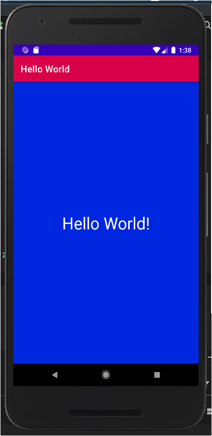

## Hello world Homework - Solution Code

The hello world homework is a simple app created from an empty template that will allow you to add a logging statement for various log levels in the onCreate method in the main activity.

### Pre-requisites

To run this app you should be familiar with:
- How to open, build, and run apps with Android Studio.
- Handling a Button click.
- Editing an XML layout file.
- Displaying a Hello World message.

### Getting Started

1. Download the code.
2. Open the code in Android Studio.
3. Run the app.

### Result

### Hello World Homework Screenshot

