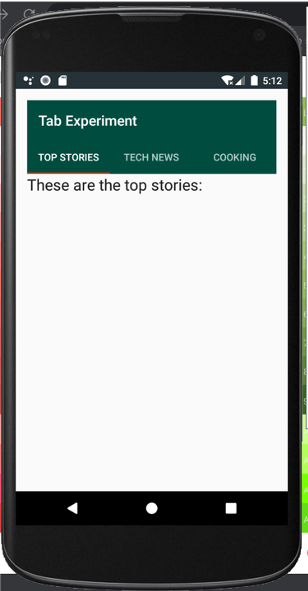
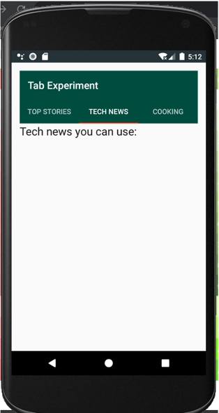
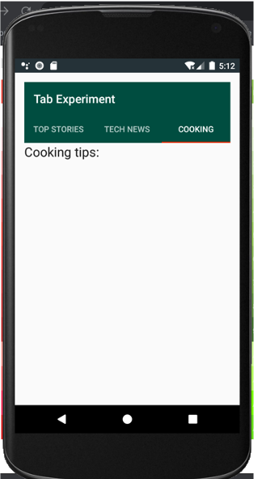

# TabExperiment Classwork - Solution Code

## Pre-requisites
To run this app you should be familiar with creating and running apps in Android Studio.

## Getting Started

1. Download the code.
2. Open the code in Android Studio.
3. Run the app.

## Result

#### TabExperiment Classwork Screenshots

